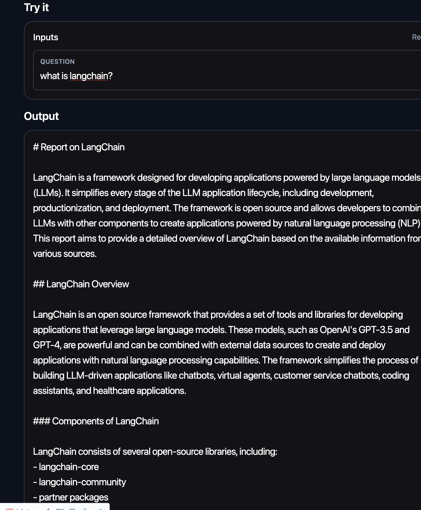
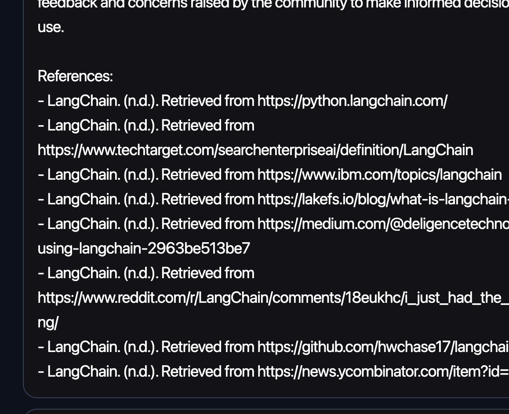

# Your Personal Research Assistant!

Tired of searching for the latest research papers? This is the solution! This assistant will answer you any
questions based on most relevant research paper and blogs! No more burden of finding the valueble sources in the digital ocean!

1. Install dependencies: `pip install -r requirements.txt`
2. Modify `env.example`, type your openai key and Serper api key, save as `.env`
3. Run `python main.py`
4. Chat with your assistant!
---

    
    

